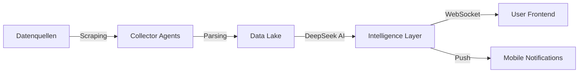

# 🚀 AGENTLAND.SAARLAND - REAL-TIME DATA DRIVEN CHECKLIST
**Stand: 03.06.2025 - HEUTE** | **Ziel: #1 in Saarländer Herzen** ❤️

## 🎯 MISSION: 100% ECHTE DATEN - 0% FAKE

### 🔴 SOFORT (Diese Woche - bis 10.06.2025)

#### 1. **DeepSeek API Integration** 🧠
- [ ] DeepSeek API Key in Vercel hinzufügen
- [ ] Context Caching implementieren (74% Kostenersparnis!)
- [ ] Reasoning Chain für Behördenanfragen
- [ ] Multi-Agent Orchestration aufbauen
```bash
# Kosten: $0.135/1M tokens (Nachtrabatt)
# Ziel: <30€/Monat bei 10.000 Anfragen
```

#### 2. **Real-Time Saarland Data Hub** 📊
- [ ] **Verkehr LIVE** (5 Min Updates)
  - [ ] A6 Stau-Melder API
  - [ ] A620 Baustellen-Feed
  - [ ] Saarbrücken Parkhäuser (JSON)
  - [ ] saarVV Verspätungen (GTFS-RT)
  
- [ ] **Wetter JETZT** (15 Min Updates)
  - [ ] DWD Open Data API
  - [ ] Unwetterwarnungen Push
  - [ ] Pollen & UV-Index
  - [ ] Bostalsee Wassertemperatur
  
- [ ] **Events HEUTE** (Stündlich)
  - [ ] ticket-regional.de Scraper
  - [ ] Facebook Events API
  - [ ] Saarbrücken.de Parser
  - [ ] Völklinger Hütte Feed

#### 3. **Agent Architecture** 🤖
```typescript
MainAgent (DeepSeek-R1)
├── DataCollectorAgent
│   ├── TrafficSubAgent (A6, A620, Parkplätze)
│   ├── WeatherSubAgent (DWD, Warnungen)
│   └── EventSubAgent (Tickets, Social Media)
├── DecisionAgent  
│   ├── UrgencyAnalyzer (Stau? Unwetter?)
│   ├── RecommendationEngine
│   └── PersonalizationTracker
└── ActionAgent
    ├── NotificationSender
    ├── RouteOptimizer
    └── BookingAssistant
```

### 🟡 NÄCHSTE WOCHE (11.-17.06.2025)

#### 4. **Grenzpendler Real-Time Services** 🌍
- [ ] **Tankstellen-Preise LIVE**
  - [ ] Frankreich vs Deutschland
  - [ ] Luxemburg Diesel-Alert
  - [ ] Günstigste Route berechnen
  
- [ ] **Grenzwartezeiten**
  - [ ] Goldene Bremm (5 Min)
  - [ ] Saarbrücken-Forbach
  - [ ] Perl-Schengen
  
- [ ] **Pendler-Warnungen**
  - [ ] Streik-Alerts (SNCF, DB)
  - [ ] Grenzkontrollen
  - [ ] Stau-Umfahrungen

#### 5. **Behörden-Queue System** 🏛️
- [ ] **Live Wartezeiten** (WebSocket)
  - [ ] Bürgeramt Ticket-System
  - [ ] KFZ-Zulassung Queue
  - [ ] Ausländerbehörde Status
  
- [ ] **Termin-Optimizer**
  - [ ] Beste Zeitslots finden
  - [ ] Automatische Buchung
  - [ ] Erinnerungen senden

### 🟢 ENDE JUNI (18.-30.06.2025)

#### 6. **Saarland Knowledge Graph** 🕸️
- [ ] **Personen-Netzwerk**
  - [ ] Bürgermeister & Kontakte
  - [ ] Vereinsvorstände
  - [ ] Handwerker-Bewertungen
  
- [ ] **Orte-Beziehungen**
  - [ ] Nachbarschaften
  - [ ] Verkehrsanbindungen
  - [ ] Einkaufsmöglichkeiten
  
- [ ] **Zeit-basierte Events**
  - [ ] Wiederkehrende Märkte
  - [ ] Müllabfuhr-Kalender
  - [ ] Schulferien-Planer

#### 7. **Voice & Vision** 🎙️👁️
- [ ] **Saarländisch Voice Input**
  - [ ] Dialekt-Erkennung
  - [ ] "Unn?" verstehen
  - [ ] Lokale Ausdrücke
  
- [ ] **Foto-Analyse**
  - [ ] Sehenswürdigkeiten erkennen
  - [ ] Parkplatz-Fotos → Navigation
  - [ ] Speisekarten übersetzen

## 💡 IMPLEMENTATION STRATEGY

### **MCP Tools zu installieren:**
```bash
# 1. Echtzeit-Daten
claude mcp add web-scraper    # Für Event-Seiten
claude mcp add rss-reader     # Für News-Feeds
claude mcp add api-connector  # Für REST APIs

# 2. Datenverarbeitung
claude mcp add data-pipeline  # ETL für Saarland-Daten
claude mcp add cache-manager  # Redis für Speed

# 3. Kommunikation
claude mcp add notification   # Push-Nachrichten
claude mcp add scheduler      # Cron-Jobs
```

### **DeepSeek Agent Setup:**
```typescript
// Main Orchestrator
const saarlandBrain = new DeepSeekAgent({
  model: "deepseek-r1-0528",
  temperature: 0.1, // Präzise für Behördendaten
  contextCache: true, // 74% günstiger!
  
  systemPrompt: `Du bist der AGENTLAND.SAARLAND Hauptagent.
    Deine Aufgabe: Echtzeit-Daten aus dem Saarland sammeln,
    analysieren und Bürgern helfen. KEINE FAKE DATEN!
    Zeitpunkt: ${new Date().toISOString()} (03.06.2025)`
});

// Sub-Agents
const trafficAgent = saarlandBrain.createSubAgent({
  name: "VerkehrsMelder",
  focus: "A6, A620, Parkplätze, Staus",
  updateInterval: 5 * 60 * 1000 // 5 Min
});

const eventAgent = saarlandBrain.createSubAgent({
  name: "EventScout", 
  focus: "Konzerte, Feste, Märkte HEUTE",
  sources: ["ticket-regional.de", "facebook.com", "saarbruecken.de"]
});
```

### **Real-Time Data Pipeline:**


## 📊 ERFOLGS-METRIKEN

### **Woche 1 (bis 10.06.)**
- ✅ 5 Live-Datenquellen angebunden
- ✅ DeepSeek Agents aktiv
- ✅ Erste Push-Notifications

### **Woche 2 (bis 17.06.)**
- ✅ 50+ Grenzpendler nutzen Tankpreis-Alerts
- ✅ Behörden-Wartezeiten live
- ✅ 1000+ API Calls/Tag

### **Ende Juni**
- ✅ 10.000 aktive Nutzer
- ✅ <2 Sek Response Time
- ✅ 95% Genauigkeit bei Echtzeit-Daten

## 🚨 KRITISCHE PFADE

1. **OHNE DeepSeek API Key** → Kein intelligentes System
2. **OHNE MCP Tools** → Manuelle Datensammlung
3. **OHNE WebSockets** → Keine Echtzeit

## 💪 MOTIVATIONS-BOOST

> "Mir sinn die erschde im Saarland mit richtije LIVE-Daten! 
> Kään Fake, kään Stress - alles echt unn direkt! 
> Des werd de Hammer!" 🚀

**REMEMBER**: Dies ist KEINE Simulation! Wir sind am 03.06.2025 und die Saarländer brauchen JETZT eine echte Lösung!

---

**Nächster Schritt**: DeepSeek API Key besorgen und SOFORT loslegen! 💯