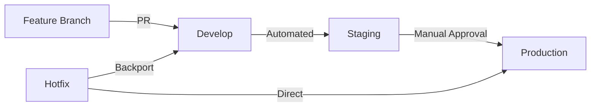

# 🏛️ AGENTLAND.SAARLAND GitOps-Strategie

## 📊 Aktueller Git-Status

**Repository:** agentland.saarland  
**Hauptbranch:** main  
**Aktuelle Branches:**
- `main` (Production)
- `feature/founder-restructure` 
- `feature/real-time-data-integration`

**Letzte Commits:**
- 📍 UPDATE: Erweiterte PLZ-Datenbank mit allen Saarland-Gemeinden
- 🏛️ FIX: Vollständige Saarland PLZ-Datenbank implementiert
- 🚀 FOUNDER RESTRUCTURE: AGENTLAND.SAARLAND 3.0

## 🌿 Branching-Strategie

### Git Flow Modell für Souveräne Entwicklung

```
main (Production)
├── develop (Staging)
│   ├── feature/saarland-tourism-agent
│   ├── feature/real-time-plz-finder
│   └── feature/deepseek-integration
├── hotfix/critical-security-fix
└── release/v2.1.0
```

### Branch-Typen

| Branch-Typ | Zweck | Lebensdauer | Merge-Ziel |
|------------|--------|-------------|-------------|
| `main` | Production-Code | Permanent | - |
| `develop` | Integration & Staging | Permanent | main |
| `feature/*` | Neue Features | Temporär | develop |
| `hotfix/*` | Kritische Fixes | Temporär | main + develop |
| `release/*` | Release-Vorbereitung | Temporär | main + develop |

### Branch-Namenskonventionen

```bash
# Features
feature/saarland-tourism-agent
feature/real-time-data-engine
feature/admin-agent-dashboard

# Hotfixes
hotfix/plz-search-critical-bug
hotfix/security-vulnerability-fix

# Releases
release/v2.1.0
release/v2.2.0-beta
```

## 📝 Commit Message Konventionen

### Format-Standard

```
<emoji> <TYPE>: <Beschreibung>

[Optionaler Body]

[Footer mit Breaking Changes und Issues]
```

### Commit-Typen mit Emojis

| Emoji | Typ | Beschreibung | Beispiel |
|-------|-----|--------------|----------|
| ✨ | FEAT | Neues Feature | `✨ FEAT: Saarland PLZ-Finder mit Echtzeitdaten` |
| 🐛 | FIX | Bugfix | `🐛 FIX: Navigation Bug in Tourism Agent behoben` |
| 💡 | UPDATE | Verbesserung | `💡 UPDATE: DeepSeek Agent Performance optimiert` |
| 🔧 | REFACTOR | Code-Refactoring | `🔧 REFACTOR: Agent Base-Klasse modularisiert` |
| 📚 | DOCS | Dokumentation | `📚 DOCS: API-Dokumentation für Agenten erweitert` |
| 🧪 | TEST | Tests | `🧪 TEST: Unit Tests für PLZ-Service hinzugefügt` |
| 🔒 | SECURITY | Sicherheit | `🔒 SECURITY: Input Validation für Agent Queries` |
| ⚡ | PERF | Performance | `⚡ PERF: Caching für Saarland-Daten implementiert` |
| 🎨 | STYLE | Code-Styling | `🎨 STYLE: ESLint Rules für TypeScript angepasst` |
| 🚀 | DEPLOY | Deployment | `🚀 DEPLOY: Vercel Production Pipeline konfiguriert` |
| 📦 | DEPS | Dependencies | `📦 DEPS: Next.js auf v14 aktualisiert` |
| 🏗️ | BUILD | Build-System | `🏗️ BUILD: Turbo Monorepo Konfiguration optimiert` |
| 🤖 | AI | KI/Agent-Updates | `🤖 AI: Neue Spezialisierungs-Agenten implementiert` |
| 📍 | DATA | Daten-Updates | `📍 DATA: Vollständige Saarland PLZ-Datenbank` |
| 🏛️ | ADMIN | Administrative | `🏛️ ADMIN: Git Workflow für Team konfiguriert` |

### Commit Message Beispiele

```bash
# Gutes Beispiel
✨ FEAT: Saarland Tourism Agent mit Echtzeitdaten

Implementiert spezialisierter Agent für Tourismus-Anfragen:
- Integration mit lokalen Event-APIs
- Mehrsprachige Unterstützung (DE/FR)
- Echtzeit-Verfügbarkeitsprüfung

Closes #142
Breaking Change: API Endpoint /tourism/* geändert

# Schlechtes Beispiel
fix stuff
```

## 🚀 Deployment Pipeline

### 3-Stufen Deployment-Strategie



### Umgebungen

| Umgebung | Branch | URL | Zweck |
|----------|--------|-----|-------|
| **Development** | feature/* | vercel-preview-*.vercel.app | Feature-Tests |
| **Staging** | develop | staging.agentland.saarland | Integration Tests |
| **Production** | main | agentland.saarland | Live-System |

### Deployment-Triggers

```yaml
# Automatische Deployments
- feature/* → Preview Deployment
- develop → Staging Deployment  
- main → Production Deployment

# Manuelle Freigaben
- Staging → Production (Manual Approval)
- Hotfix → Production (Emergency Process)
```

## 🔀 Merge-Strategien

### Merge-Richtlinien

| Szenario | Strategie | Command |
|----------|-----------|---------|
| Feature → Develop | Squash & Merge | `git merge --squash feature/name` |
| Develop → Main | Merge Commit | `git merge --no-ff develop` |
| Hotfix → Main | Fast-Forward | `git merge hotfix/name` |

### Pull Request Workflow

```bash
# 1. Feature entwickeln
git start-feature saarland-tourism-agent

# 2. Regelmäßig commiten
git add .
git commit  # Template öffnet sich automatisch

# 3. Push und PR erstellen
git push -u origin feature/saarland-tourism-agent

# 4. Code Review abwarten
# 5. Nach Approval: Squash & Merge
```

## ⚙️ Git-Konfiguration

### Automatisches Setup

```bash
# Git für AGENTLAND.SAARLAND konfigurieren
./scripts/git-setup.sh
```

### Manuelle Konfiguration

```bash
# Commit Message Template
git config commit.template .gitmessage

# Merge-Strategie
git config pull.rebase true
git config merge.ff false

# Hilfreiche Aliases
git config alias.graph 'log --graph --pretty=format:"%Cred%h%Creset -%C(yellow)%d%Creset %s %Cgreen(%cr) %C(bold blue)<%an>%Creset" --abbrev-commit'
git config alias.start-feature '!f() { git checkout develop && git pull && git checkout -b feature/$1; }; f'
git config alias.finish-feature '!f() { git checkout develop && git merge --no-ff feature/$1 && git branch -d feature/$1; }; f'
```

## 🔒 Branch Protection Rules

### Geschützte Branches

```yaml
main:
  required_reviews: 2
  dismiss_stale_reviews: true
  require_code_owner_reviews: true
  required_status_checks:
    - ci/build
    - ci/test
    - ci/security-scan
  restrictions:
    push: ["admin-team"]
    merge: ["admin-team"]

develop:
  required_reviews: 1
  required_status_checks:
    - ci/build
    - ci/test
```

## 🚦 Quality Gates

### Automatische Checks

```yaml
Pre-Commit Hooks:
  - TypeScript Type Check
  - ESLint Validation  
  - Prettier Format Check
  - Unit Test Execution

Pre-Push Hooks:
  - Integration Tests
  - Security Scan
  - Dependency Audit

CI/CD Pipeline:
  - Build Verification
  - E2E Tests
  - Performance Tests
  - Security Analysis
```

## 📋 Workflow Commands

### Täglicher Workflow

```bash
# Feature starten
git start-feature neue-funktion

# Entwickeln mit konsistenten Commits
git add .
git commit  # Template wird verwendet

# Feature beenden
git finish-feature neue-funktion

# Code Review via PR auf GitHub/GitLab
```

### Hotfix Workflow

```bash
# Kritischen Bug beheben
git start-hotfix kritischer-bug

# Fix entwickeln
git add .
git commit -m "🐛 FIX: Kritischer Bug in PLZ-Suche behoben"

# Hotfix abschließen (deployed auf main + develop)
git finish-hotfix kritischer-bug
```

### Release Workflow

```bash
# Release vorbereiten
git checkout develop
git pull
git checkout -b release/v2.1.0

# Version bumpen & letzte Änderungen
npm version 2.1.0
git commit -m "🚀 RELEASE: Version 2.1.0 vorbereitet"

# Release abschließen
git checkout main
git merge --no-ff release/v2.1.0
git tag v2.1.0
git checkout develop  
git merge --no-ff release/v2.1.0
git branch -d release/v2.1.0
```

## 📊 Monitoring & Analytics

### Git Metriken

```bash
# Commit-Häufigkeit
git log --oneline --since="1 month ago" | wc -l

# Contributor-Statistiken  
git shortlog -sn --since="1 month ago"

# Branch-Status
git for-each-ref --format='%(refname:short) %(committerdate)' refs/heads

# Code Churn
git log --stat --since="1 week ago"
```

## 🎯 Best Practices

### DO's ✅

- **Kleine, fokussierte Commits** - Ein Commit = Eine logische Änderung
- **Beschreibende Branch-Namen** - `feature/saarland-tourism-agent`
- **Regelmäßige Syncs** - Täglich `git pull` von develop
- **Code Reviews** - Minimum 1 Reviewer für features
- **Tests vor Merge** - Alle Tests müssen grün sein
- **Semantic Commits** - Konsistente Commit-Messages

### DON'Ts ❌

- **Direkt in main pushen** - Immer über develop/feature branches
- **Riesen-Commits** - Nicht 50+ Files in einem Commit ändern
- **Generic Messages** - "fix stuff" oder "update code"
- **Force Push auf shared branches** - Niemals `git push --force` auf main/develop
- **Sensitive Daten committen** - API Keys gehören in .env (gitignored)

## 🚀 Sofortige Implementierung

### 1. Git-Konfiguration anwenden

```bash
cd /Users/deepsleeping/agentlandos
./scripts/git-setup.sh
```

### 2. Erste strukturierte Commits

```bash
# Aktuellen Stand committen
git add .
git commit  # Template öffnet sich

# Beispiel-Message:
# 🏛️ ADMIN: GitOps-Strategie für AGENTLAND.SAARLAND implementiert
# 
# - CI/CD Pipeline mit GitHub Actions
# - Strukturierte Branch-Strategie (Git Flow)
# - Commit Message Konventionen mit Emojis
# - Automatische Code Quality Checks
# - Vercel Integration für 3-Stufen Deployment
# 
# Closes #GitOps-Setup
```

### 3. Branch-Struktur etablieren

```bash
# Develop branch erstellen falls nicht vorhanden
git checkout -b develop
git push -u origin develop

# Feature branch für nächste Entwicklung
git start-feature echte-saarland-daten-integration
```

---

**🏛️ Diese GitOps-Strategie ermöglicht souveräne, skalierbare Entwicklung für AGENTLAND.SAARLAND mit industriellen Standards und regionaler Identität.**