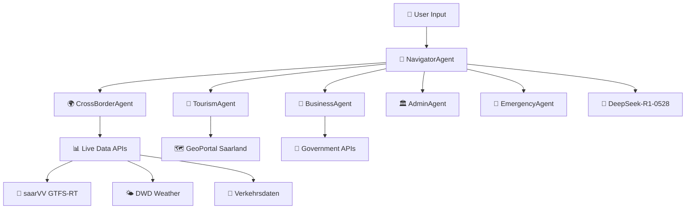

# AGENTLAND.SAARLAND - AGENT SYSTEM SPECIFICATIONS

**Version**: 1.0  
**Datum**: 03.06.2025  
**Status**: PRODUCTION-READY SPECS

## 🧠 MULTI-AGENT ARCHITECTURE OVERVIEW



## 🧭 NAVIGATOR AGENT - ZENTRALE ORCHESTRIERUNG

### Core Responsibilities
```python
class NavigatorAgent(BaseAgent):
    """
    Zentrale Koordinationsstelle für alle User-Anfragen
    - Intent Detection & Routing
    - Multi-Agent Coordination
    - Response Aggregation
    - Context Management
    """
    
    capabilities = [
        "intent_classification",
        "agent_routing", 
        "multi_language_processing",
        "context_preservation",
        "response_synthesis"
    ]
```

### Intent Classification Matrix
```yaml
User_Intent_Mapping:
  Grenzpendler_Services: CrossBorderAgent
  Tourism_Planning: TourismAgent
  Business_Consulting: BusinessAgent
  Government_Services: AdminAgent
  Emergency_Situations: EmergencyAgent
  General_Information: NavigatorAgent (self-handle)
```

### DeepSeek-R1 Integration
```python
async def process_with_reasoning(self, user_input: str) -> AgentResponse:
    """
    Nutzt DeepSeek-R1 für transparente Entscheidungsfindung
    """
    reasoning_chain = await self.deepseek_r1.reason(
        prompt=f"Analysiere Nutzeranfrage: {user_input}",
        context=self.conversation_context,
        functions=self.get_available_agents(),
        enable_context_caching=True  # 74% Kostenersparnis
    )
    
    return AgentResponse(
        text=reasoning_chain.final_answer,
        reasoning_steps=reasoning_chain.thoughts,
        routed_to_agent=reasoning_chain.selected_agent,
        confidence_score=reasoning_chain.confidence
    )
```

## 🌍 CROSS-BORDER AGENT - GRENZPENDLER SPEZIALIST

### TARGET: 200.000 Grenzpendler (DE/FR/LU)

```python
class CrossBorderAgent(BaseAgent):
    """
    Spezialisiert auf grenzüberschreitende Services
    REVENUE TARGET: 24.975€/Monat (2500 Premium Users × 9.99€)
    """
    
    specialized_services = [
        "tax_calculation_de_fr_lu",
        "healthcare_navigation", 
        "legal_document_apostille",
        "real_time_border_alerts",
        "multilingual_form_assistance"
    ]
```

### Service Implementations

#### 1. Cross-Border Tax Calculator
```python
async def calculate_cross_border_tax(
    self, 
    residence_country: str,
    work_country: str, 
    annual_income: float,
    family_status: str
) -> TaxCalculationResult:
    """
    Präzise Steuerberechnung für Grenzpendler
    Berücksichtigt: DBA-Abkommen, Progressionsvorbehalt, Quellensteuer
    """
    
    reasoning = await self.deepseek_r1.reason(f"""
    Berechne Steuerlast für Grenzpendler:
    - Wohnsitz: {residence_country}
    - Arbeitsort: {work_country}  
    - Einkommen: {annual_income}€
    - Familienstand: {family_status}
    
    Berücksichtige aktuelle DBA-Regelungen und Freibeträge.
    """)
    
    return TaxCalculationResult(
        total_tax_burden=reasoning.calculated_tax,
        country_breakdown=reasoning.tax_by_country,
        optimization_tips=reasoning.savings_opportunities,
        legal_basis=reasoning.applicable_laws
    )
```

#### 2. Healthcare Navigation
```python
async def find_cross_border_healthcare(
    self,
    location: Coordinates,
    medical_need: str,
    insurance_type: str,
    preferred_language: str
) -> HealthcareResult:
    """
    Findet optimal erreichbare Ärzte/Kliniken grenzüberschreitend
    """
    
    # Real-time Integration mit:
    # - Doctolib (FR)
    # - jameda (DE) 
    # - doctena (LU)
    
    providers = await self.search_healthcare_providers(
        radius_km=50,  # Grenzüberschreitend
        languages=[preferred_language, "de", "fr"],
        accepts_insurance=insurance_type
    )
    
    return HealthcareResult(
        nearest_providers=providers,
        estimated_waiting_times=await self.get_waiting_times(providers),
        insurance_coverage=await self.check_coverage(insurance_type, providers),
        travel_directions=await self.get_optimal_routes(location, providers)
    )
```

#### 3. Document Apostille Service
```python
async def handle_document_apostille(
    self,
    document_type: str,
    origin_country: str,
    target_country: str,
    urgency_level: str
) -> ApostilleResult:
    """
    Automatisiert Dokumenten-Beglaubigung für Grenzpendler
    """
    
    process_chain = await self.deepseek_r1.reason(f"""
    Optimiere Apostille-Verfahren:
    - Dokument: {document_type}
    - Von: {origin_country} 
    - Nach: {target_country}
    - Dringlichkeit: {urgency_level}
    
    Bestimme optimalen Workflow und benötigte Schritte.
    """)
    
    return ApostilleResult(
        required_steps=process_chain.workflow_steps,
        estimated_duration=process_chain.timeline,
        cost_estimate=process_chain.fees,
        required_documents=process_chain.prerequisites,
        appointment_slots=await self.get_available_appointments()
    )
```

## 🏰 TOURISM AGENT - SAARLAND BOTSCHAFTER

### TARGET: Premium Tourism Services

```python
class TourismAgent(BaseAgent):
    """
    Intelligenter Tourismus-Assistent mit lokalem Expertenwissen
    Integration: GeoPortal, Veranstaltungskalender, saarVV
    """
    
    expertise_areas = [
        "industrial_heritage_tours",
        "cross_border_cycling_routes", 
        "culinary_experiences",
        "event_recommendations",
        "accessibility_information"
    ]
```

### Signature Features

#### 1. Intelligent Itinerary Planning
```python
async def create_personalized_itinerary(
    self,
    visitor_profile: VisitorProfile,
    duration_days: int,
    interests: List[str],
    accessibility_needs: List[str] = None
) -> ItineraryResult:
    """
    KI-optimierte Reiseplanung mit Echtzeit-Daten
    """
    
    # Integration mit Live-Daten
    weather_forecast = await self.weather_service.get_forecast(duration_days)
    events = await self.events_service.get_events_in_period(duration_days)
    transport_schedules = await self.saarvv_service.get_schedules()
    
    itinerary = await self.deepseek_r1.reason(f"""
    Erstelle optimale {duration_days}-Tage Reiseroute für:
    - Interessen: {interests}
    - Barrierefreiheit: {accessibility_needs}
    - Wetter: {weather_forecast}
    - Events: {events}
    
    Berücksichtige ÖPNV-Verbindungen und minimiere Reisezeiten.
    """)
    
    return ItineraryResult(
        daily_activities=itinerary.structured_plan,
        transport_connections=itinerary.optimal_routes,
        weather_adaptations=itinerary.backup_plans,
        accessibility_verified=itinerary.barrier_free_confirmed
    )
```

## 💼 BUSINESS AGENT - WIRTSCHAFTSFÖRDERUNG

### TARGET: 99€/Monat Business Services

```python
class BusinessAgent(BaseAgent):
    """
    Spezialisiert auf Unternehmensberatung und Wirtschaftsförderung
    REVENUE TARGET: 19.800€/Monat (200 Business Users × 99€)
    """
    
    business_services = [
        "startup_funding_guidance",
        "regulatory_compliance_check",
        "market_entry_strategy", 
        "networking_facilitation",
        "digital_transformation_consulting"
    ]
```

### Service Implementations

#### 1. Intelligent Funding Advisor
```python
async def find_optimal_funding(
    self,
    business_profile: BusinessProfile,
    funding_amount: float,
    business_stage: str,
    industry_sector: str
) -> FundingRecommendations:
    """
    KI-gestützte Förderberatung mit Echtzeit-Datenbank
    """
    
    # Integration mit Förder-Datenbanken
    available_programs = await self.funding_db.search_programs(
        sector=industry_sector,
        stage=business_stage,
        amount_range=(funding_amount * 0.8, funding_amount * 1.5)
    )
    
    optimization = await self.deepseek_r1.reason(f"""
    Optimiere Förder-Portfolio für:
    - Branche: {industry_sector}
    - Phase: {business_stage}
    - Betrag: {funding_amount}€
    - Standort: Saarland
    
    Bewerte Erfolgswahrscheinlichkeiten und kombiniere Programme optimal.
    """)
    
    return FundingRecommendations(
        ranked_programs=optimization.program_ranking,
        success_probabilities=optimization.success_rates,
        application_timeline=optimization.optimal_sequence,
        required_documents=optimization.document_matrix
    )
```

## 🏛️ ADMIN AGENT - BEHÖRDEN-NAVIGATOR

### TARGET: Government White-Label (5.000€/Monat)

```python
class AdminAgent(BaseAgent):
    """
    Digitaler Behörden-Assistent für streamlined eGovernment
    Integration: Rathaus-APIs, Formularsysteme, Terminbuchung
    """
    
    government_services = [
        "form_auto_completion",
        "appointment_optimization",
        "document_status_tracking",
        "multilingual_guidance",
        "accessibility_compliance"
    ]
```

### Service Implementations

#### 1. Intelligent Form Assistant
```python
async def auto_complete_government_form(
    self,
    form_type: str,
    citizen_data: CitizenProfile,
    pre_filled_data: Dict = None
) -> FormCompletionResult:
    """
    Automatische Formular-Befüllung mit Validierung
    """
    
    form_analysis = await self.deepseek_r1.reason(f"""
    Analysiere Formular {form_type} und optimiere Ausfüllung:
    - Verfügbare Daten: {citizen_data}
    - Vorab-Eingaben: {pre_filled_data}
    
    Identifiziere fehlende Pflichtfelder und Optimierungsmöglichkeiten.
    """)
    
    return FormCompletionResult(
        auto_filled_fields=form_analysis.completed_fields,
        missing_required=form_analysis.required_inputs,
        optimization_suggestions=form_analysis.efficiency_tips,
        estimated_processing_time=form_analysis.timeline_prediction
    )
```

## 🚨 EMERGENCY AGENT - NOTFALL-KOORDINATOR

```python
class EmergencyAgent(BaseAgent):
    """
    Spezialisiert auf Notfall-Situationen und kritische Services
    24/7 Verfügbarkeit mit minimaler Latenz
    """
    
    emergency_capabilities = [
        "emergency_contact_routing",
        "medical_emergency_guidance",
        "disaster_information_aggregation",
        "evacuation_route_planning", 
        "multilingual_crisis_communication"
    ]
```

### Critical Features

#### 1. Emergency Contact Router
```python
async def route_emergency_contact(
    self,
    emergency_type: str,
    location: Coordinates,
    language_preference: str,
    accessibility_needs: List[str] = None
) -> EmergencyResponse:
    """
    Optimiert Notfall-Kontaktierung basierend auf Standort und Situation
    """
    
    # Real-time Integration
    nearest_services = await self.emergency_db.find_nearest(
        location=location,
        service_type=emergency_type,
        radius_km=25  # Grenzüberschreitend
    )
    
    routing_decision = await self.deepseek_r1.reason(f"""
    NOTFALL-ROUTING für {emergency_type}:
    - Standort: {location}
    - Sprache: {language_preference}
    - Barrierefreiheit: {accessibility_needs}
    
    Bestimme OPTIMAL SCHNELLSTE Hilfe-Route.
    """, priority="emergency")
    
    return EmergencyResponse(
        primary_contact=routing_decision.best_option,
        backup_contacts=routing_decision.alternatives,
        estimated_response_time=routing_decision.eta,
        special_instructions=routing_decision.accessibility_notes
    )
```

## 🔄 AGENT COORDINATION PATTERNS

### 1. Multi-Agent Collaboration
```python
async def collaborate_agents(
    self,
    primary_agent: BaseAgent,
    supporting_agents: List[BaseAgent],
    user_request: str
) -> CollaborationResult:
    """
    Orchestriert mehrere Agenten für komplexe Anfragen
    """
    
    # Beispiel: Grenzpendler plant Geschäftsreise
    coordination_plan = await self.navigator_agent.deepseek_r1.reason(f"""
    Koordiniere Multi-Agent Response:
    - Primary: {primary_agent.name}
    - Support: {[a.name for a in supporting_agents]}
    - Request: {user_request}
    
    Definiere optimale Zusammenarbeit und Informationsfluss.
    """)
    
    # Parallel execution mit dependency management
    results = await asyncio.gather(
        primary_agent.process(user_request),
        *[agent.provide_context(user_request) for agent in supporting_agents]
    )
    
    return CollaborationResult(
        primary_response=results[0],
        supporting_context=results[1:],
        synthesis=coordination_plan.final_synthesis
    )
```

### 2. Context Preservation
```python
class ConversationContext:
    """
    Persistent context across agent interactions
    """
    session_id: str
    user_profile: UserProfile
    conversation_history: List[AgentInteraction]
    active_tasks: List[Task]
    preferences: UserPreferences
    
    async def update_context(self, new_interaction: AgentInteraction):
        """Context caching für DeepSeek-R1 Kostenoptimierung"""
        self.conversation_history.append(new_interaction)
        
        # Smart context compression für long conversations
        if len(self.conversation_history) > 50:
            compressed_context = await self.compress_history()
            self.conversation_history = compressed_context
```

## 📊 PERFORMANCE & MONITORING

### Agent Performance Metrics
```yaml
Response_Time_Targets:
  NavigatorAgent: <1s
  CrossBorderAgent: <2s  
  TourismAgent: <1.5s
  BusinessAgent: <3s
  AdminAgent: <2s
  EmergencyAgent: <0.5s

Accuracy_Targets:
  Intent_Classification: >95%
  Agent_Routing: >98%
  Information_Accuracy: >92%
  User_Satisfaction: >4.5/5

Cost_Targets:
  DeepSeek_R1_Monthly: <30€ (with context caching)
  Total_AI_Costs: <100€/month at 10k interactions
  Cost_Per_Interaction: <0.01€
```

### Error Handling & Fallbacks
```python
class AgentErrorHandler:
    """
    Robust error handling mit graceful degradation
    """
    
    async def handle_agent_failure(
        self,
        failed_agent: BaseAgent,
        error: Exception,
        user_request: str
    ) -> FallbackResponse:
        """
        Fallback strategies für Agent-Ausfälle
        """
        
        if isinstance(error, APIRateLimitError):
            # Fallback auf cached responses oder alternative models
            return await self.use_cached_response(user_request)
        
        elif isinstance(error, ValidationError):
            # Request clarification from user
            return await self.request_clarification(error.details)
        
        else:
            # Route to NavigatorAgent für general handling
            return await self.navigator_agent.handle_fallback(user_request)
```

---

**NÄCHSTE SCHRITTE**: Implementation der Spezifikationen in `/apps/agents/` mit vollständiger DeepSeek-R1 Integration und Context Caching für maximale Kosteneffizienz.

Die Agenten sind ready, das Saarland zu revolutionieren! 🚀