# AGENTLAND.SAARLAND - API SPECIFICATIONS

**Version**: 1.0  
**Datum**: 03.06.2025  
**Standard**: OpenAPI 3.0.3

## 🚀 API ARCHITECTURE OVERVIEW

```mermaid
graph LR
    Client[🌐 Client Apps] --> Gateway[🔒 API Gateway]
    Gateway --> Auth[🔐 Auth Service]
    Gateway --> Agents[🤖 Agent Endpoints]
    Gateway --> Data[📊 Data Services]
    Gateway --> Realtime[⚡ Real-time APIs]
    
    Agents --> NavigatorAPI[🧭 Navigator]
    Agents --> CrossBorderAPI[🌍 CrossBorder] 
    Agents --> TourismAPI[🏰 Tourism]
    Agents --> BusinessAPI[💼 Business]
    Agents --> AdminAPI[🏛️ Admin]
    
    Data --> LiveDataAPI[📡 Live Data]
    Data --> RAGAPI[🔍 RAG Search]
    Data --> AnalyticsAPI[📈 Analytics]
```



## 🔑 AUTHENTICATION & AUTHORIZATION

### JWT Token Structure
```yaml
Header:
  alg: "RS256"
  typ: "JWT"
  kid: "agentland-2025-key"

Payload:
  iss: "agentland.saarland"
  sub: "user_uuid"
  aud: "agentland-api"
  exp: 1735689600  # 1 hour
  iat: 1735686000
  scope: ["chat", "premium", "cross-border"]
  user_tier: "premium" | "free" | "enterprise"
  rate_limit: 1000  # requests per hour
```

### API Key Tiers
```yaml
Free_Tier:
  rate_limit: 100/hour
  features: ["basic_chat", "tourism_info"]
  cost: 0€

Premium_Tier:
  rate_limit: 1000/hour
  features: ["cross_border", "document_assist", "priority_support"]
  cost: 9.99€/month

Business_Tier:
  rate_limit: 10000/hour
  features: ["business_consulting", "api_access", "custom_integrations"]
  cost: 99€/month

Enterprise_Tier:
  rate_limit: unlimited
  features: ["white_label", "dedicated_agents", "sla_support"]
  cost: 5000€/month
```

## 🤖 AGENT ENDPOINTS

### POST /api/v1/agents/chat
**Core Multi-Agent Chat Interface**

```yaml
openapi: 3.0.3
paths:
  /api/v1/agents/chat:
    post:
      summary: "Multi-Agent Chat Interface"
      description: "Zentrale Chat-Schnittstelle mit DeepSeek-R1 und Agent-Routing"
      security:
        - BearerAuth: []
      requestBody:
        required: true
        content:
          application/json:
            schema:
              type: object
              required: [message, session_id]
              properties:
                message:
                  type: string
                  description: "User input message"
                  example: "Ich bin Grenzpendler und brauche Hilfe bei der Steuer"
                  maxLength: 10000
                session_id:
                  type: string
                  format: uuid
                  description: "Conversation session ID"
                language:
                  type: string
                  enum: ["de", "fr", "en", "saarländisch"]
                  default: "de"
                context:
                  type: object
                  description: "Additional context data"
                  properties:
                    location:
                      $ref: '#/components/schemas/Coordinates'
                    user_profile:
                      $ref: '#/components/schemas/UserProfile'
                enable_reasoning:
                  type: boolean
                  default: true
                  description: "Show DeepSeek-R1 reasoning steps"
                max_cost_cents:
                  type: integer
                  description: "Maximum AI cost in cents"
                  default: 10
      responses:
        200:
          description: "Agent response with routing and reasoning"
          content:
            application/json:
              schema:
                $ref: '#/components/schemas/AgentResponse'
        429:
          description: "Rate limit exceeded"
          content:
            application/json:
              schema:
                $ref: '#/components/schemas/RateLimitError'
        402:
          description: "Cost limit exceeded"
          content:
            application/json:
              schema:
                $ref: '#/components/schemas/CostLimitError'
```

### Response Schema
```yaml
components:
  schemas:
    AgentResponse:
      type: object
      required: [text, agent_id, session_id, cost_cents]
      properties:
        text:
          type: string
          description: "Agent response text"
          example: "Als Grenzpendler können Sie von verschiedenen Steuervorteilen profitieren..."
        agent_id:
          type: string
          enum: ["navigator", "cross_border", "tourism", "business", "admin", "emergency"]
          description: "Which agent handled the request"
        session_id:
          type: string
          format: uuid
        reasoning_steps:
          type: array
          items:
            type: string
          description: "DeepSeek-R1 reasoning chain (if enabled)"
          example: 
            - "User ist Grenzpendler -> Route zu CrossBorderAgent"
            - "Steuerliche Frage -> Aktiviere Steuerberatungs-Tools"
            - "Berechne optimale Steuerstruktur für DE/LU Grenzpendler"
        confidence_score:
          type: number
          minimum: 0
          maximum: 1
          description: "Agent confidence in response accuracy"
        cost_cents:
          type: integer
          description: "Actual cost of this interaction in cents"
        suggested_actions:
          type: array
          items:
            $ref: '#/components/schemas/SuggestedAction'
        context_updated:
          type: boolean
          description: "Whether conversation context was updated"
        rate_limit_remaining:
          type: integer
          description: "Remaining requests in current window"
```

## 🌍 CROSS-BORDER SERVICES

### POST /api/v1/cross-border/tax-calculator
**Grenzpendler Steuerberechnung**

```yaml
/api/v1/cross-border/tax-calculator:
  post:
    summary: "Cross-Border Tax Calculator"
    description: "Präzise Steuerberechnung für Grenzpendler DE/FR/LU"
    security:
      - BearerAuth: []
    requestBody:
      required: true
      content:
        application/json:
          schema:
            type: object
            required: [residence_country, work_country, annual_income]
            properties:
              residence_country:
                type: string
                enum: ["DE", "FR", "LU"]
                description: "Country of residence"
              work_country:
                type: string
                enum: ["DE", "FR", "LU"]
                description: "Country of employment"
              annual_income:
                type: number
                minimum: 0
                maximum: 1000000
                description: "Annual gross income in EUR"
              family_status:
                type: string
                enum: ["single", "married", "civil_partnership", "divorced", "widowed"]
              children_count:
                type: integer
                minimum: 0
                maximum: 20
              special_circumstances:
                type: array
                items:
                  type: string
                  enum: ["disabled", "student", "pensioner", "self_employed"]
    responses:
      200:
        description: "Tax calculation result"
        content:
          application/json:
            schema:
              $ref: '#/components/schemas/TaxCalculationResult'
```

### GET /api/v1/cross-border/healthcare/search
**Grenzüberschreitende Arztsuche**

```yaml
/api/v1/cross-border/healthcare/search:
  get:
    summary: "Cross-Border Healthcare Search"
    description: "Find doctors and hospitals across DE/FR/LU borders"
    security:
      - BearerAuth: []
    parameters:
      - name: location
        in: query
        required: true
        schema:
          type: string
          description: "Current location (address or coordinates)"
          example: "Saarbrücken, Germany"
      - name: specialty
        in: query
        schema:
          type: string
          description: "Medical specialty"
          example: "cardiologist"
      - name: language
        in: query
        schema:
          type: string
          enum: ["de", "fr", "en", "lu"]
          description: "Preferred language"
      - name: insurance_type
        in: query
        schema:
          type: string
          enum: ["public_de", "private_de", "cpam_fr", "cns_lu"]
          description: "Insurance type"
      - name: radius_km
        in: query
        schema:
          type: integer
          minimum: 5
          maximum: 100
          default: 50
          description: "Search radius in kilometers"
    responses:
      200:
        description: "Healthcare providers found"
        content:
          application/json:
            schema:
              type: object
              properties:
                providers:
                  type: array
                  items:
                    $ref: '#/components/schemas/HealthcareProvider'
                total_found:
                  type: integer
                search_radius_used:
                  type: integer
```

## 🏰 TOURISM SERVICES

### POST /api/v1/tourism/itinerary
**Intelligente Reiseplanung**

```yaml
/api/v1/tourism/itinerary:
  post:
    summary: "AI-Powered Itinerary Planning"
    description: "Generate personalized Saarland itineraries with live data"
    security:
      - BearerAuth: []
    requestBody:
      required: true
      content:
        application/json:
          schema:
            type: object
            required: [duration_days, interests]
            properties:
              duration_days:
                type: integer
                minimum: 1
                maximum: 14
                description: "Trip duration in days"
              interests:
                type: array
                items:
                  type: string
                  enum: ["culture", "nature", "industry", "gastronomy", "sports", "family"]
                description: "Visitor interests"
              accessibility_needs:
                type: array
                items:
                  type: string
                  enum: ["wheelchair", "visual_impaired", "hearing_impaired", "cognitive"]
              budget_range:
                type: string
                enum: ["budget", "mid_range", "luxury"]
              group_size:
                type: integer
                minimum: 1
                maximum: 50
              starting_location:
                $ref: '#/components/schemas/Coordinates'
              transportation_mode:
                type: string
                enum: ["walking", "cycling", "public_transport", "car"]
    responses:
      200:
        description: "Personalized itinerary"
        content:
          application/json:
            schema:
              $ref: '#/components/schemas/ItineraryResult'
```

## 💼 BUSINESS SERVICES

### POST /api/v1/business/funding/search
**Förderberatung**

```yaml
/api/v1/business/funding/search:
  post:
    summary: "AI-Powered Funding Advisor"
    description: "Find optimal funding programs for Saarland businesses"
    security:
      - BearerAuth: []
    requestBody:
      required: true
      content:
        application/json:
          schema:
            type: object
            required: [business_stage, industry_sector, funding_amount]
            properties:
              business_stage:
                type: string
                enum: ["idea", "startup", "growth", "expansion", "innovation"]
              industry_sector:
                type: string
                enum: ["tech", "manufacturing", "healthcare", "renewable_energy", "automotive"]
              funding_amount:
                type: number
                minimum: 1000
                maximum: 10000000
                description: "Required funding in EUR"
              company_size:
                type: string
                enum: ["micro", "small", "medium", "large"]
              has_partnerships:
                type: boolean
                description: "Has international partnerships"
              research_component:
                type: boolean
                description: "Project includes R&D component"
    responses:
      200:
        description: "Funding recommendations"
        content:
          application/json:
            schema:
              $ref: '#/components/schemas/FundingRecommendations'
```

## 🏛️ ADMIN SERVICES

### POST /api/v1/admin/forms/autocomplete
**Formular Auto-Completion**

```yaml
/api/v1/admin/forms/autocomplete:
  post:
    summary: "Government Form Auto-Completion"
    description: "AI-powered form filling for government services"
    security:
      - BearerAuth: []
    requestBody:
      required: true
      content:
        application/json:
          schema:
            type: object
            required: [form_type, citizen_id]
            properties:
              form_type:
                type: string
                enum: ["passport", "id_card", "residence_permit", "business_registration", "tax_return"]
              citizen_id:
                type: string
                description: "Encrypted citizen identifier"
              pre_filled_data:
                type: object
                description: "Already available form data"
              language:
                type: string
                enum: ["de", "fr", "en"]
    responses:
      200:
        description: "Form completion result"
        content:
          application/json:
            schema:
              $ref: '#/components/schemas/FormCompletionResult'
```

## 📊 LIVE DATA SERVICES

### GET /api/v1/data/transport/realtime
**saarVV Echtzeit-Daten**

```yaml
/api/v1/data/transport/realtime:
  get:
    summary: "Real-time Transport Data"
    description: "Live saarVV transport information"
    security:
      - BearerAuth: []
    parameters:
      - name: stop_id
        in: query
        schema:
          type: string
          description: "saarVV stop ID"
      - name: location
        in: query
        schema:
          type: string
          description: "Location coordinates or address"
      - name: radius_meters
        in: query
        schema:
          type: integer
          default: 500
          maximum: 2000
    responses:
      200:
        description: "Real-time transport data"
        content:
          application/json:
            schema:
              type: object
              properties:
                stops:
                  type: array
                  items:
                    $ref: '#/components/schemas/TransportStop'
                last_updated:
                  type: string
                  format: date-time
                data_quality:
                  type: string
                  enum: ["excellent", "good", "fair", "poor"]
```

### GET /api/v1/data/weather/current
**DWD Wetter-Daten**

```yaml
/api/v1/data/weather/current:
  get:
    summary: "Current Weather Data"
    description: "Live weather from DWD (Deutscher Wetterdienst)"
    security:
      - BearerAuth: []
    parameters:
      - name: location
        in: query
        required: true
        schema:
          type: string
          description: "City name or coordinates"
      - name: include_forecast
        in: query
        schema:
          type: boolean
          default: false
      - name: forecast_days
        in: query
        schema:
          type: integer
          minimum: 1
          maximum: 7
          default: 3
    responses:
      200:
        description: "Weather data"
        content:
          application/json:
            schema:
              $ref: '#/components/schemas/WeatherData'
```

## 🔍 RAG & SEARCH SERVICES

### POST /api/v1/search/rag
**Vector Search mit RAG**

```yaml
/api/v1/search/rag:
  post:
    summary: "Retrieval-Augmented Generation Search"
    description: "Semantic search through Saarland knowledge base"
    security:
      - BearerAuth: []
    requestBody:
      required: true
      content:
        application/json:
          schema:
            type: object
            required: [query]
            properties:
              query:
                type: string
                maxLength: 1000
                description: "Search query"
              language:
                type: string
                enum: ["de", "fr", "en"]
                default: "de"
              categories:
                type: array
                items:
                  type: string
                  enum: ["government", "tourism", "business", "transport", "healthcare"]
              max_results:
                type: integer
                minimum: 1
                maximum: 50
                default: 10
              similarity_threshold:
                type: number
                minimum: 0
                maximum: 1
                default: 0.7
    responses:
      200:
        description: "Search results with generated answer"
        content:
          application/json:
            schema:
              type: object
              properties:
                generated_answer:
                  type: string
                  description: "AI-generated answer based on search results"
                sources:
                  type: array
                  items:
                    $ref: '#/components/schemas/SearchResult'
                search_quality:
                  type: number
                  description: "Quality score of search results"
                processing_time_ms:
                  type: integer
```

## 📈 ANALYTICS & MONITORING

### GET /api/v1/analytics/usage
**API Usage Analytics**

```yaml
/api/v1/analytics/usage:
  get:
    summary: "API Usage Analytics"
    description: "Get usage statistics and cost breakdown"
    security:
      - BearerAuth: []
    parameters:
      - name: period
        in: query
        schema:
          type: string
          enum: ["hour", "day", "week", "month"]
          default: "day"
      - name: start_date
        in: query
        schema:
          type: string
          format: date
      - name: end_date
        in: query
        schema:
          type: string
          format: date
    responses:
      200:
        description: "Usage analytics"
        content:
          application/json:
            schema:
              type: object
              properties:
                total_requests:
                  type: integer
                requests_by_endpoint:
                  type: object
                total_cost_cents:
                  type: integer
                cost_by_agent:
                  type: object
                average_response_time_ms:
                  type: number
                error_rate:
                  type: number
                rate_limit_hits:
                  type: integer
```

## 💰 BILLING & MONETIZATION

### GET /api/v1/billing/current
**Current Billing Status**

```yaml
/api/v1/billing/current:
  get:
    summary: "Current Billing Information"
    description: "Get current billing cycle information"
    security:
      - BearerAuth: []
    responses:
      200:
        description: "Billing information"
        content:
          application/json:
            schema:
              type: object
              properties:
                current_tier:
                  type: string
                  enum: ["free", "premium", "business", "enterprise"]
                monthly_quota:
                  type: integer
                  description: "Monthly request quota"
                quota_used:
                  type: integer
                  description: "Requests used this month"
                quota_remaining:
                  type: integer
                current_cost_cents:
                  type: integer
                  description: "Cost accumulated this month"
                billing_cycle_start:
                  type: string
                  format: date
                billing_cycle_end:
                  type: string
                  format: date
                next_charge_date:
                  type: string
                  format: date
                upgrade_options:
                  type: array
                  items:
                    $ref: '#/components/schemas/BillingTier'
```

## 🚨 ERROR HANDLING

### Standard Error Response
```yaml
components:
  schemas:
    ErrorResponse:
      type: object
      required: [error, message, status_code]
      properties:
        error:
          type: string
          description: "Error type identifier"
        message:
          type: string
          description: "Human-readable error message"
        status_code:
          type: integer
          description: "HTTP status code"
        details:
          type: object
          description: "Additional error details"
        request_id:
          type: string
          description: "Unique request identifier for debugging"
        timestamp:
          type: string
          format: date-time
```

### Error Codes
```yaml
Error_Codes:
  4001: "Invalid API key"
  4002: "API key expired"
  4003: "Insufficient permissions"
  4291: "Rate limit exceeded"
  4292: "Quota exceeded"
  4021: "Payment required - upgrade tier"
  4022: "Cost limit exceeded"
  5001: "Agent service unavailable"
  5002: "DeepSeek API error"
  5003: "Database connection failed"
  5004: "External API timeout"
```

## 📚 DATA MODELS

### Core Schemas
```yaml
components:
  schemas:
    Coordinates:
      type: object
      required: [latitude, longitude]
      properties:
        latitude:
          type: number
          minimum: -90
          maximum: 90
        longitude:
          type: number
          minimum: -180
          maximum: 180
        
    UserProfile:
      type: object
      properties:
        user_id:
          type: string
          format: uuid
        language_preference:
          type: string
          enum: ["de", "fr", "en", "saarländisch"]
        accessibility_needs:
          type: array
          items:
            type: string
        location:
          $ref: '#/components/schemas/Coordinates'
        interests:
          type: array
          items:
            type: string
        subscription_tier:
          type: string
          enum: ["free", "premium", "business", "enterprise"]
    
    SuggestedAction:
      type: object
      properties:
        action_type:
          type: string
          enum: ["book_appointment", "download_form", "get_directions", "call_number"]
        title:
          type: string
        description:
          type: string
        action_data:
          type: object
        estimated_time:
          type: string
          description: "Estimated time to complete"
```

## 🔒 SECURITY HEADERS

### Required Headers
```yaml
Security_Headers:
  Authorization: "Bearer {jwt_token}"
  X-API-Key: "{api_key}"  # Alternative to JWT
  X-Rate-Limit-Tier: "{tier_name}"
  X-Request-ID: "{uuid}"  # For tracking
  X-Client-Version: "{version}"
  Content-Type: "application/json"
  Accept: "application/json"
  User-Agent: "AgentlandClient/{version}"
```

### CORS Configuration
```yaml
CORS_Configuration:
  allowed_origins:
    - "https://agentland.saarland"
    - "https://*.agentland.saarland"
    - "https://localhost:3000"  # Development
  allowed_methods: ["GET", "POST", "PUT", "PATCH", "DELETE", "OPTIONS"]
  allowed_headers: ["Authorization", "Content-Type", "X-API-Key", "X-Request-ID"]
  max_age: 86400  # 24 hours
  allow_credentials: true
```

---

**IMPLEMENTIERUNG STATUS**: Diese Spezifikationen sind ready für die sofortige Implementierung in `/apps/api/` mit FastAPI und automatic OpenAPI documentation generation.

Die APIs sind designed für 200.000 Grenzpendler und 50.000€/Monat Revenue - let's build! 🚀